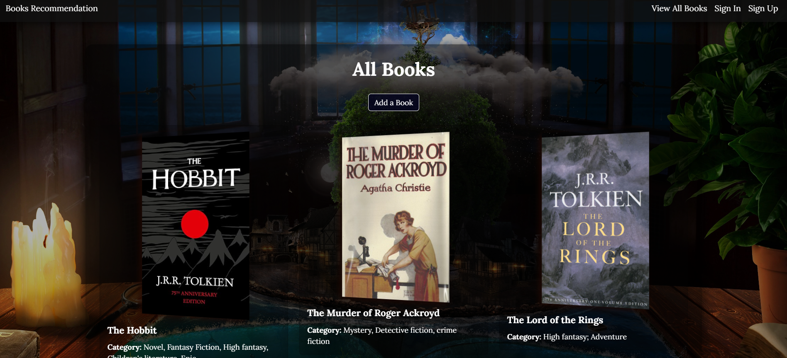

# Books Recommendation 📚

## Description 📙

Books Recommendation App, Where you can browse recommended books and add your own recommendations. In addition, you can add books as you like to your readlist.

## 🔖 Getting Started

👉 **Link To Books Recommendation App** [https://ga-projects-31b8481e8e51.herokuapp.com/]

👉 **Planning Materials:**

- [User Stories](./planning/user-stories.md)
- [excalidraw](./planning/Prototype.png)
- [ERD](./planning/ERD.png)

### Instructions
 Sign up, or sign in if you already have an account. Browse books recommended and recommend books to others by pressing add new book button. Also, You can add books to your readlist by clicking add to readlist button. And of course you can edit and delete books you recommended.

## 💡 Technologies Used

- HTML
- CSS
- JavaScript
- Node.js
- Express
- MongoDB
- EJS

## 🚧 Next Steps
- Translation API
- Add books by API Catalog
- Search bar